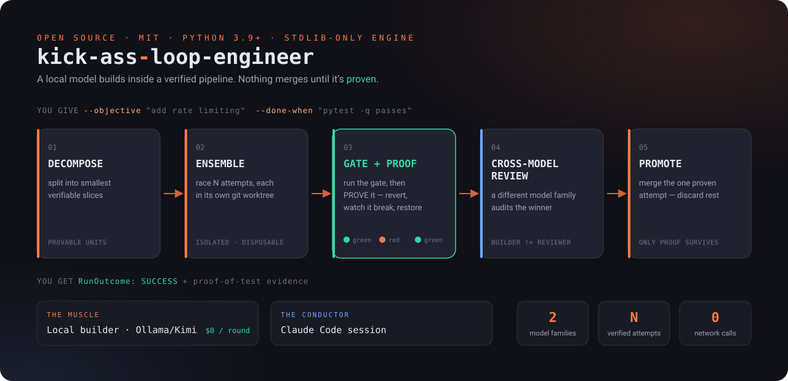
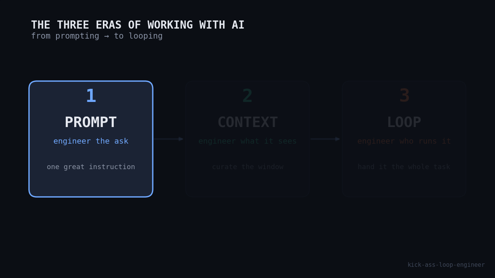
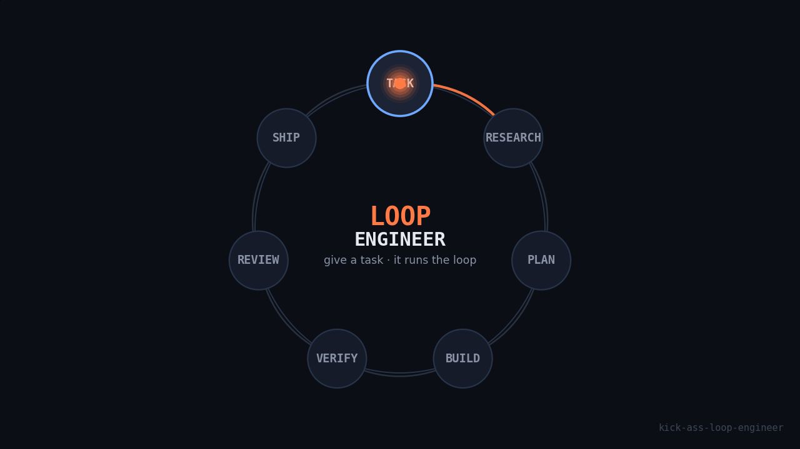
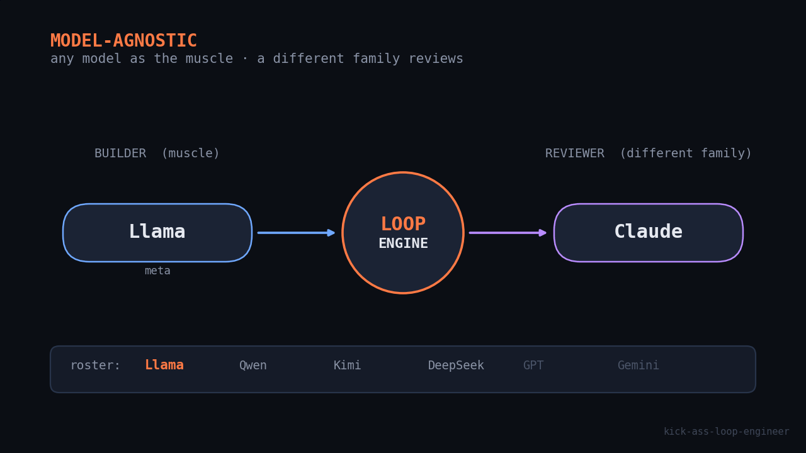
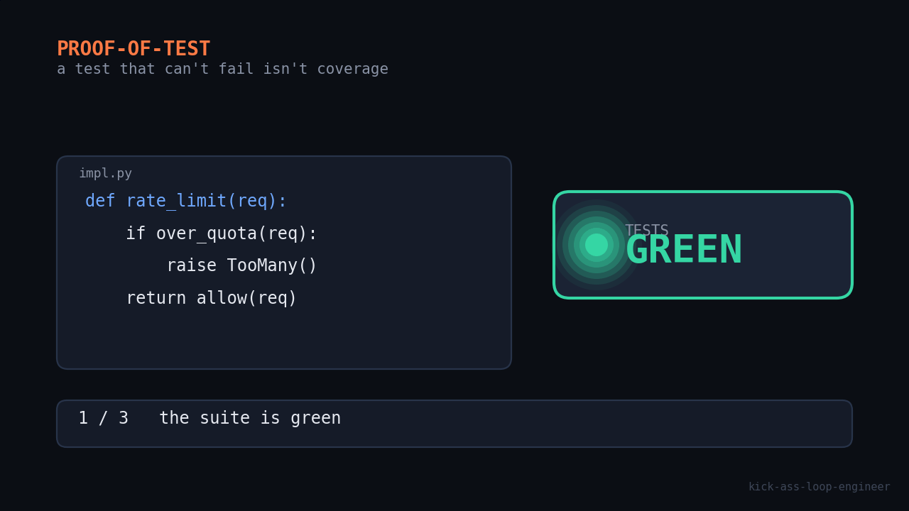
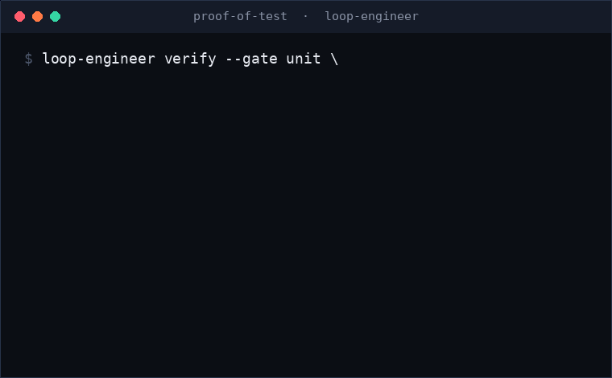

<div align="center">

# 🔥 kick-ass-loop-engineer

**A model-agnostic, multi-agent build/review loop. A local model does the building; a verified pipeline makes sure nothing ships until it's _proven_.**

[](LICENSE)
[](https://www.python.org)
[](#why-its-different)
[](#tests)



</div>

You hand it an **objective** and a checkable **done-when**. A local/cloud builder model
(Ollama / Kimi) writes the code each round — cheaply. A verified pipeline decomposes the
work, races competing attempts in throwaway git worktrees, **proves** the tests actually
test the change, has a _different_ model family review the winner, and promotes only the
one attempt that survived. You can drive it from a **Claude Code session** (`/loop-engineer`)
or run the pipeline standalone from the CLI.

---

*Three eras got us here: you engineered the **prompt**, then the **context** — this tool is the **loop**.*



## The problem: you're the loop

Work with an AI model the usual way and **you are the loop.** You prompt, read the output,
spot the wrong import or the invented API, re-type the correction, and go again — holding all
the state in your head and rebuilding context from scratch every session. The model does the
thirty-second part; **you** run the iteration by hand, forever. Call it the **re-prompting tax.**

Every workaround people reach for — snippet files, a "here's our stack" preamble pasted each
morning, a doc of prompts that "worked" — is really an attempt to escape the single turn.

## What changes: you give it a task, it decides what it needs

kick-ass-loop-engineer takes the loop off your hands. You describe an **outcome** and a
**checkable done-when** — and the machine works out the rest:

- it **interviews you only on the genuinely ambiguous parts** — a six-slot think-tank
  (purpose, users, constraints, success metrics, anti-goals, risks), one question at a time —
  and infers the rest (indentation, test runner, file layout) from your repo;
- it **researches** the facts it will rely on, and refuses to build on an unverified guess;
- it **builds, verifies against real artifacts, and has a different model family review** the
  result — then reports an outcome you can act on.

You stop babysitting turns and start reviewing outcomes. That's the whole pitch: **describe
the destination, not every step.**



## Who it's for

- **Solo devs & indie hackers** who want a second (and third) set of hands that works while
  they don't — without a frontier-model bill for every iteration.
- **Teams** that want *cheap* iteration and *high-judgment* review: the grind runs on a local
  model; the expensive model only arbitrates.
- **Anyone running local models** (via Ollama — Llama, Qwen, Kimi, DeepSeek) who wants real
  verification instead of "the tests pass, trust me."
- **Tinkerers & researchers** exploring autonomous build/verify loops who want the guardrails
  enforced in code, not in a polite prompt.

If you've ever thought *"I've explained this to the model four times already"* — that's the
itch this scratches.

---

## Why it's different

Most "AI writes code" loops stop at _"the tests pass."_ This one doesn't trust that.

| | What most loops do | What kick-ass-loop-engineer does |
|---|---|---|
| **Verification** | Trusts a green check | **Proof-of-test**: reverts the change, confirms tests go **red**, restores, confirms **green** — a test that can't fail isn't coverage |
| **Selection** | One attempt, hope it's right | **Ensemble** of _N_ attempts in isolated git worktrees; the gate-passing one wins |
| **Review** | The same model marks its own work | **Cross-model review** — the reviewer is a _different model family_ (Kimi → Qwen → Claude) |
| **Cost** | Burns frontier tokens every round | **$0 on local models** — the builder is Ollama/Kimi; the frontier session only judges |
| **Trust** | Prompt-level "please don't" | Guardrails enforced **in code** — workspace jail, protected paths, command allowlist, scrubbed env |
| **Provenance** | Builds on model guesses | A mandatory **research gate** — load-bearing claims can't be `[ASSUMED]`; citations are re-fetched and checked |
| **Footprint** | Heavy dependency tree | **stdlib-only engine**, zero network calls inside the pipeline (only `pyyaml` for config) |

Every merge carries its own proof. That's the whole idea.

---

## How it works

The session is a **dispatcher**; the engine decides what's next from artifacts on disk; the
builder model does the heavy lifting. A single run flows through:

```
objective + done-when
        │
        ▼
  ① decompose      split into independently verifiable slices
        │
        ▼
  ② ensemble       race N attempts, each in its own throwaway git worktree
        │
        ▼
  ③ gate + PROOF   run the gate — then prove it: green → revert → red → restore → green
        │
        ▼
  ④ cross-model    a different model family audits the winning attempt
     review
        │
        ▼
  ⑤ promote        merge the one proven, reviewed attempt; discard the rest
        │
        ▼
   RunOutcome  { state, reason, evidence }   ← one JSON object, with proof
```

When driven from Claude Code, a session-level **dispatcher loop** (`loop-engineer next`)
wraps this with staged skills — a mandatory **research** gate first, then `plan` → `engine`
→ `review` → `qa` → `security` → `ship` — each emitting one JSON envelope the session acts
on. Stage is derived from artifacts, never the transcript, so the loop resumes cleanly after
a crash or context reset.

---

## Quick start

**Zero-install, straight from the repo** — [uv](https://docs.astral.sh/uv/) runs the CLI in an
ephemeral isolated env (the package is pure stdlib + `pyyaml`, so it builds in seconds):

```bash
# run the CLI with no clone, no pip, no virtualenv
uvx --from git+https://github.com/Patibandha/kick-ass-loop-engineer loop-engineer --help

# or from a local checkout while developing
uvx --from /path/to/kick-ass-loop-engineer loop-engineer --help
```

`uvx` is ideal for a one-off `loop-engineer verify` or `run`. For day-to-day use and the
`/loop-engineer` Claude Code skill, install the package:

```bash
# 1. install (Python 3.9+; only runtime dep is pyyaml)
git clone https://github.com/Patibandha/kick-ass-loop-engineer.git
cd kick-ass-loop-engineer
pip install -e . --break-system-packages

# 2. point it at a builder model (default: Ollama serving a Kimi coder tag)
loop-engineer init                 # writes ./loop-engineer.yaml
ollama pull kimi-k2.7-code:cloud   # or any local tag you've pulled

# 3. run the full verified pipeline (workspace must be a git repo)
loop-engineer run \
  --objective "add a rate limiter to the API" \
  --done-when "python3 -m pytest -q passes" \
  --workspace ./my-project \
  --config loop-engineer.yaml
```

Exit code mirrors the terminal state: `0` = `success`, `2` = any other terminal state, `1` = a
config/setup error (e.g. a builder/reviewer same-family clash). The full `RunOutcome`
(`{state, reason, evidence}`) is printed as JSON on stdout.

**Prefer to drive it from Claude Code?** Install the skill and use `/loop-engineer`:

```bash
mkdir -p ~/.claude/skills && cp -r .claude/skills/loop-engineer ~/.claude/skills/
```

Then, in a Claude Code session, give it a goal **and** a runnable done-when:

```
/loop-engineer add a CLI todo app in ./todo with add/list/done;
done when `python -m unittest discover -s todo/tests` passes
```

> **Always give a concrete, runnable done-when** (a test command, a build, a lint). The loop
> cannot converge on a vague target ("feels fast") and will ask you to make it checkable.

---

## The two engines

| | Role | Runs on | Cost |
|---|---|---|---|
| **The muscle** | Writes the code each round, inside the guarded pipeline | Local/cloud model via Ollama (Kimi, Qwen, Llama…) | **$0** on local models |
| **The conductor** | Orchestrates the loop, dispatches skills, arbitrates on risk | Your Claude Code session (flat-rate) | subscription |

The engine itself makes **no network calls** — it shells out to your configured provider and
otherwise runs on the Python standard library.

### Bring your own model — literally any model

Model-agnostic is the whole point, and as of 3.0 it's the honest, shipped state of it. There
are **four native backends** — pick any as the builder or the reviewer:

- **`ollama`** — any local or cloud-proxied model (Meta **Llama**, **Qwen**, **Kimi**,
  **DeepSeek**), `$0` on local.
- **`openai_compat`** — _any endpoint that speaks OpenAI `/chat/completions`_. This is the big
  one: **ChatGPT, Gemini** (via its OpenAI layer), **Grok, DeepSeek, Mistral, Qwen, OpenRouter,
  Groq, Together** — and every mainstream **local** runtime (llama.cpp server, LM Studio, vLLM,
  local Ollama). One adapter, first-class — **no shim, no rewrite.** You change only `base_url`,
  `model`, and the *name* of the env var holding your key; the key itself never lives in config.
- **`anthropic`** — the Anthropic Messages API.
- **`claude_code`** — headless Claude Code (`claude -p`) for frontier/dispatcher roles.

So ChatGPT / Gemini / Groq / vLLM / any OpenAI-style server are **first-class builders and
reviewers now**, not shims. The one rule the engine enforces is that **the reviewer is a
different model family than the builder** — checked against the *constructed* provider, not a
config label — so no model grades its own homework. For a third-party model family detection
can't classify, declare it with a `family:` key.



---

## Diverse ensembles

For a hard slice the loop doesn't take one shot — it races **N competing attempts** in isolated
worktrees and keeps the one whose gates PASS (a selection, never a merge; among passers the
simplest wins the tiebreak). 3.0 makes those attempts **diverse by construction**, so they don't
all wander into the same corner of the solution space:

- **Auto temperature ladder** — with just `ensemble.n`, attempts vary on a deterministic ladder
  (`0.2, 0.7, 1.0`, then `+0.3` steps capped at `1.5`): `n: 2` gives you one conservative attempt
  and one creative one, and the same `n` always yields the same specs.
- **Per-attempt models** — set `ensemble.attempts` to a list of `{model, temperature?, provider?,
  family?}` and each attempt can be a *different model or vendor entirely* — Kimi vs. Qwen vs. a
  third-party `openai_compat` endpoint, all racing the same slice.

**Gates still pick the winner — always.** Diversity only changes how each attempt is *built*;
nothing scores an attempt by its temperature or model. And the cross-model guard holds at **two
layers**: every attempt spec is family-checked against the reviewer at config time (before a cent
is spent), and the *winning* attempt's real constructed provider is re-checked at review time — so
no attempt can sneak past into grading its own work.

---

## Staffing controller (Jev) — new in 3.2

Every run used to pay for the same team whatever the job: competing attempts, QA, security,
ship, and the same review depth, whether it was a README typo or a payment flow. 3.2 adds a
**decision model** that sizes the team for each run. It uses
[TypeSafe Jev](https://docs.typesafe.ai), which picks from declared options and returns a
probability for each, and falls back to deterministic rules.

**What the model decides** (two batched calls per run, well under a cent):

- risk tier;
- security depth: **L1** gates → **L2** plus an AI security review → **L3** plus strict
  blocking review → **L4** plus human sign-off;
- whether QA and DevOps/ship run, review depth, and whether builders must write tests;
- whether the architect stage runs;
- attempts per slice and the starting model tier;
- one stall recovery.

**Cheapest passing model wins.** With `decision.tiers` (a cheap-to-strong builder ladder),
attempts start on the tier the model picks, climb one tier on failure, and **stop at the
first pass**. The stronger models are only paid for when the cheaper ones fail.

**Quality floors are code, not model output.**
- The model may raise any floor and never lower one.
- If the objective touches a sensitive domain (auth, payments, secrets, data, infra),
  security is at least L2, review is at least standard, and QA runs.
- Auth, payments and secrets force L3.
- `signoff_domains` force L4, and the loop asks a human before ship.
- A low-confidence answer or a Jev outage falls back to the pre-3.2 behavior, so the
  worst case is yesterday's run.
- Gates, proof-of-test, the escalation denylist and the budget cap are untouched: a
  decision model decides *how much effort to spend*, never *whether the work is correct*.

**Private and auditable.**
- Only allowlisted, typed facts are sent. Code, logs, files and the environment never
  are, and anything secret-shaped fails closed.
- Reach Jev directly (`route: typesafe`) or through Cloudflare Workers AI
  (`route: cloudflare`, zero data retention).
- Every decision and the run's outcome go to `.loop-engineer/decisions.jsonl`, and a
  resumed run replays them instead of asking again.

```yaml
decision:
  backend: jev                 # jev (falls back to rules) | rules (offline)
  route: cloudflare            # typesafe (TYPESAFE_API_KEY) | cloudflare (CLOUDFLARE_ACCOUNT_ID + _API_TOKEN)
  min_confidence: 0.7
  max_attempts: 3
  floors: {security: L1, review: light}
  signoff_domains: [payments, infra, auth, secrets]
  tiers:
    - model: qwen2.5-coder:7b
    - model: kimi-k2.7-code:cloud
```

Absent a `decision:` section, every run behaves exactly as in 3.1.

---

## Configuration

`loop-engineer init` writes `loop-engineer.yaml` from the committed
[`loop-engineer.example.yaml`](loop-engineer.example.yaml) template:

```yaml
builder:
  provider: ollama            # claude_code | ollama | anthropic | openai_compat
  model: kimi-k2.7-code:cloud  # any pulled Ollama tag
  host: http://localhost:11434

# builder:                    # ALTERNATIVE: any OpenAI-compatible /chat/completions endpoint
#   provider: openai_compat
#   model: gpt-5.5
#   base_url: https://api.openai.com/v1   # or Gemini/OpenRouter/Groq/local — see Backends
#   api_key_env: OPENAI_API_KEY           # NAME of the env var holding the key, never the key
#   family: gpt                           # third-party models declare a family for the guard

reviewer:                      # cross-model reviewer — family MUST differ from the builder
  provider: ollama
  model: qwen2.5

guardrails:
  max_file_bytes: 1000000
  max_files_per_round: 50
  allow_overwrite: true

# gates:                       # verifier gate for the pipeline (defaults shown)
#   name: unit                 # unit | security | data_leak | performance | smoke
#   cmd: "python3 -m pytest -q"  # must be on the verification allowlist
#   prove: true                # proof-of-test: revert → red → green

# ledger:  { run_cap_usd: 10, month_cap_usd: 200 }   # $ caps + notify hook (optional)
# ensemble: { n: 2 }                                  # competing attempts per hard slice
# decision: { backend: jev, route: cloudflare }       # 3.2 staffing controller (see above)
```

`loop-engineer.yaml` is gitignored (machine-specific); the `.example.yaml` is the committed
template. The pipeline runs with sane defaults even if you delete the optional sections.

### Backends

| Provider | Use it for | Billing |
|---|---|---|
| `ollama` | Local or cloud-proxied models (Kimi, Qwen, Llama) | Free local / cloud compute |
| `openai_compat` | **Any** OpenAI `/chat/completions` endpoint — ChatGPT, Gemini (OpenAI layer), Grok, DeepSeek, Mistral, Qwen, OpenRouter, Groq, Together, and local runtimes (llama.cpp, LM Studio, vLLM) | Vendor pay-as-you-go / free local |
| `anthropic` | Anthropic Messages API | Pay-as-you-go API |
| `claude_code` | Headless Claude Code (`claude -p`) | Subscription credit |

For `openai_compat`, only `base_url`, `model`, and `api_key_env` (the env-var *name*) change —
e.g. OpenAI `https://api.openai.com/v1`, Gemini `https://generativelanguage.googleapis.com/v1beta/openai`,
OpenRouter `https://openrouter.ai/api/v1`, Groq `https://api.groq.com/openai/v1`, local Ollama
`http://localhost:11434/v1`. The key stays in your environment, never in config.

---

## CLI reference

| Command | What it does |
|---|---|
| `loop-engineer init [--path PATH] [--ui]` | Write a starter `loop-engineer.yaml`; `--ui` also adds a Playwright `ui` gate and scaffolds `playwright.config.ts` + a smoke spec. |
| `loop-engineer run --objective … --done-when … [--workspace DIR] [--config FILE] [--mode auto\|build\|enhance\|fix\|audit] [--architect\|--no-architect]` | The **full verified pipeline** (decompose → architect → ensemble → gates+proof → cross-model review → promote). Prints one JSON `RunOutcome`. |
| `loop-engineer refine --build "<idea>" [--done-when …] [--interview]` | Assess an idea against a six-slot think-tank gate + a measurability lint; write `SPEC.md`/`GOAL.md` when ready, or return the gaps/questions. |
| `loop-engineer next --workspace DIR [--available csv]` | Emit **one** dispatcher envelope (`invoke_skill` / `invoke_agent` / `run_engine` / `verify_citations` / `ask_user` / `terminal`) for the calling session. Always exits 0; state lives in the envelope. |
| `loop-engineer verify --gate <gate> --cmd "<allowlisted>" [--prove] --workspace DIR` | Run a named gate and emit a JSON evidence record `{gate, command, passed, evidence, proof}`. |
| `loop-engineer build --objective … --done-when … [--round N] [--max-rounds N]` | One guarded builder round (low-level; the pipeline runs this internally). JSON on stdout, progress on stderr. |

`kickass <cmd>` is an alias for `loop-engineer <cmd>`.

---

## Proof-of-test



The feature the whole design is built around. When a gate runs with `prove: true`, the engine
doesn't just check that the suite is green — it **proves the test exercises the change**:

1. Confirm the suite is currently **green**.
2. Revert the implementation file(s) to force a **red** state.
3. Re-run — assert it goes **red** (if it stays green, the test is theater → the gate fails).
4. Restore the implementation — assert it goes **green** again.

The gate only counts as passed if the full **green → red → green** sequence completes.
Verdicts come from real artifact captures, not the chat transcript.



> The GIF above is a **real** `loop-engineer verify --prove` run, recorded by
> [`scripts/make_demo_gif.py`](scripts/make_demo_gif.py) — revert the change, watch the suite go
> red, restore it, watch it go green. Regenerate it any time with `python3 scripts/make_demo_gif.py`.

### Gate categories

| Gate | Checks |
|---|---|
| `unit` | Unit tests pass |
| `security` | Security scan / audit exits 0 |
| `data_leak` | No secrets or PII leaked into output |
| `performance` | Benchmark / timing assertion passes |
| `smoke` | Basic integration / end-to-end command passes |
| `ui` | Browser DOM-assertion tests (Playwright) pass |
| `architecture` | Declared-architecture conformance (import-linter) holds |

In config, `gates:` is a **list** — each entry names a gate kind, its allowlisted command, and a
per-gate `prove:` toggle; the pipeline runs them in order, fail-fast, per attempt and at
finalization.

---

## Terminal states

Every run ends in exactly one of seven states (the process exit code is `0` for `success`,
`2` for everything else):

| State | Meaning |
|---|---|
| `success` | Goal verified — with proof. |
| `stalled` | No attempt passed its gate; needs human input. |
| `blocked` | A hard blocker (missing dep, permission, final gate) stops progress. |
| `budget_exceeded` | The `$`/iteration budget was exhausted first. |
| `approval_required` | A risky action hit the escalation denylist and needs sign-off. |
| `oscillation` | The reviewer keeps returning the same finding — no convergence. |
| `research_blocked` | A load-bearing claim was `[ASSUMED]`, or a citation couldn't be confirmed — the run stops rather than build on a guess. |

---

## Run journal

Every run writes an append-only journal to `<workspace>/.loop-engineer/events.jsonl` — one line
per event (`{ts, run_id, event, payload}`) that lets you **reconstruct the whole run afterward**
without re-running anything. `attempt_started` records each attempt's spec (model + temperature),
`gate_result` records every gate's verdict and whether it was `proven`, `observer_ran` and
`format_retry` trace the retry loop, and `cost_recorded` accounts each provider call in dollars
(reconciling with the ledger, which stays the source of truth for money). Replay it into a
timeline and every gate verdict lines up with the outcome evidence — the proof isn't just in the
final report, it's in the tape. The journal is deliberately never deduplicated, so a consumer
reconstructing a resumed run just tolerates the re-announced durable events.

---

## Security

Guardrails are enforced **in code, not just prompts**:

- **Workspace jail** — writes can't escape the workspace; protected paths (`.git`, `.env`,
  keys, `*secret*`, `*credentials*`) are refused; file size/count caps.
- **Verification allowlist** — only known test/lint/build commands run, with shell
  metacharacters rejected and model keys (`ANTHROPIC_API_KEY`/`AUTH_TOKEN`,
  `TYPESAFE_API_KEY`, `CLOUDFLARE_API_TOKEN`) scrubbed from the child env.
- **Escalation denylist** — risky verbs (`deploy`, `drop table`, `rm -rf`, force-push) and
  sensitive paths (`secrets/`, `*/auth/`, `*payment*`) park the run for human approval.
- Generated output is treated as **untrusted data** — never executed, never followed as
  instructions. See [`.claude/skills/loop-engineer/references/security.md`](.claude/skills/loop-engineer/references/security.md).

---

## Roadmap

**Shipped in 3.0 — the goals from this list are now done:**

- ✅ **Universal provider support.** The `openai_compat` backend makes *any* OpenAI-compatible
  endpoint first-class — ChatGPT, Gemini, Grok, DeepSeek, Mistral, Qwen, OpenRouter, Groq,
  Together, and every mainstream local runtime — alongside native `ollama`, `anthropic`, and
  `claude_code`. Pick literally any model as builder or reviewer and mix families freely.
- ✅ **Design-first architect stage** — validated Mermaid diagrams and executable
  architecture-conformance gates for multi-slice work.
- ✅ **Working "eyes" for browser work** — `ui` gates, a failure observer, an `init --ui`
  scaffold, and an advisory VLM screenshot critique.
- ✅ **Brownfield modes** — `build` / `enhance` / `fix` / `audit`: repo-context briefs,
  reproduce-first bugfixes, and read-only findings sweeps.
- ✅ **Diverse ensembles** (per-attempt temperature/model) and a **run journal** that
  reconstructs any run post-hoc.

**Shipped in 3.1 – 3.2:**

- ✅ **Agentic in-place builders** (`claude_code`, `gemini`) with transient-failure retry, and
  builder commits un-committed before harvest.
- ✅ **Gates that must prove their output** (`expect` / `min_count`) and **review findings that
  can block** a slice at a chosen severity.
- ✅ **Staffing controller** — a decision model sizes the team above deterministic quality
  floors, with a cheap→strong tier cascade.

**Still ahead — honestly labeled _not yet built_:**

- **Calibration from the decision journal** — learn per-decision confidence thresholds from
  logged outcomes, so the loop knows which of its own staffing calls it can trust.

- **Observability & control plane** (a separate repo) — a multi-channel notifier
  (Telegram / WhatsApp / Slack), a live web dashboard, and a mobile PWA, all consumers of the
  run journal's event stream — so you can watch and steer long autonomous runs without
  babysitting a terminal.

---

## Version history

Full detail in [CHANGELOG.md](CHANGELOG.md). The short story:

| Version | Milestone | What it added |
|---|---|---|
| **3.2.0** | Jev staffing controller _(current)_ | A decision model sizes each run above deterministic quality floors: risk tier, security depth L1–L4, QA/DevOps on/off, review depth, tests, architect, attempts and model tier per slice, and stall recovery. Adds a cheap→strong tier cascade, human sign-off for chosen domains, a decision journal replayed on resume, and TypeSafe or Cloudflare (zero-retention) routes. |
| `3.1.x` | Agentic builders | In-place `claude_code`/`gemini` builders, transient retry, `escalation.allow_tokens`, un-commit before harvest, additive proof-of-test, gate `expect`/`min_count`, blocking review severities. |
| **3.0.0** | Any model, verifiable everywhere | Native `openai_compat` provider (any OpenAI-compatible endpoint), design-first architect stage + architecture-conformance gates, `ui` gates with a failure observer, brownfield task modes (`build`/`enhance`/`fix`/`audit`), diverse ensembles, and the run journal — over `uvx`, with a real proof-of-test demo. |
| **2.0.0** | Deep research + GA | Mandatory research/provenance gate (tag coverage + citation re-fetch), `research_blocked` state, and the `2.0` line's GA. |
| `2.0.0-alpha.3` | Think-tank interview (2.0-M3) | Six-slot `refine --interview` (purpose/users/constraints/metrics/anti-goals/risks) + a measurability lint that rejects vague done-whens. |
| `2.0.0-alpha.2` | Next protocol (2.0-M2) | The session **dispatcher loop** — `loop-engineer next` emits one artifact-derived envelope per step; crash/reset-safe. |
| `2.0.0-alpha.1` | Pipeline core (2.0-M1) | The standalone verified pipeline: decompose → ensemble in worktrees → gates+proof → cross-model review → promote, as one `RunOutcome`. |
| **1.0.0** | First stable | Verifier spine + proof-of-test, ensemble (N=2) with verified selection, cross-model review, SQLite memory + cross-run playbook, loop-auditor, L3-gated autonomy + escalation denylist, `$`/run cap. |
| `1.0.0-alpha.1…4` | 1.0 M1–M4 | Rebrand + verifier core → single-loop brain → multi-model + ensemble → memory + governance. |
| `0.1 – 0.2` | Origin (as `loopforge`) | Initial model-agnostic build/review loop with an internal reviewer. |

---

## Tests

```bash
python3 -m pytest -q        # the engine's own suite — 1,044 tests in 3.2.0
```

The engine is Python 3.12-tested, `>= 3.9` compatible, and depends only on `pyyaml` at runtime.

---

## License

[MIT](LICENSE) © Alpha AI. Build freely — just keep the proof.
